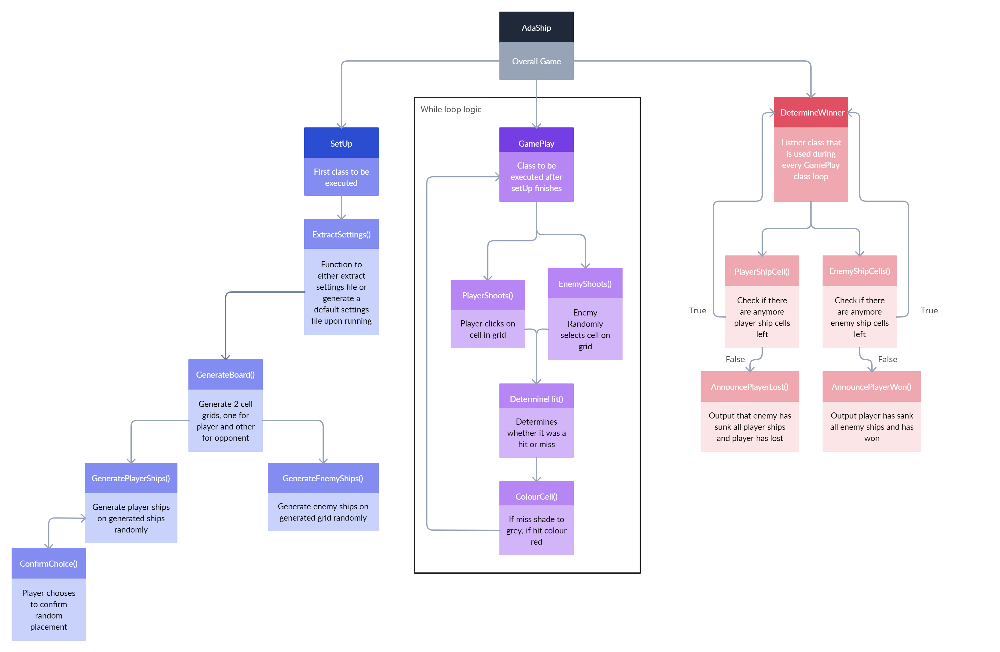

Nikita Zyrianov's submission for Advanced Programming module Week 2 Coursework
-
Synopsis
=
This project was created using the Visual Studio open source software that
includes loads of prebuilt libraries specifically designed to create desktop
applications that include a GUI (a windowed application). This is how I attempted
to solve this challenge in C++. I understand that other programming languages have
a friendlier learning curve and will let me meet the criteria of this challenge
quicker but I wish to challenge myself and see what I could accomplish in the
3 weeks given to do this challenge. Unfortanetly, due to work commitments/deadlines,
I was not able to get this prototype to the level of quality that I would have
liked but ultimately this has been a great learning experience as I learnt how to
effectively manage my project, plan out what needs to be achieved, break down the
problem with abstraction to make the work more managable, and also with the time 
constraints; learning which feature is more valuable to have as opposed to other
features.
#
Running Adaship
=
In the git repository, there should be an adaship.exe ready to run. I am not sure 
if this will work on a different OS but I believe as long as you have Visual C++ 
Redistibutable installed on your machine it should work fine. If all else fails 
I would attempt to try and running it in the visual studio ide but you will still 
be able to see how the program is meant to run in the video :)
#
Challenge Outline
=

Overview
-
The challenge was to create a complex object-oriented program using an agile 
methodology that incorporates/blends in these aspects: \
• Problem Outline and Analysis. \
• Task or story backlog with clear definitions of done. \
• Evaluated Requirements reviewed and linked to required features and functions. \
• Use and incorporation of networking capability. \
• UML overall logic and/or data diagram. \
• Code Smells, reuse / reusable. \
• Fundamental OO: classes, objects, instantiation. \
• AdvancedOO: inheritance, composition, encapsulation, polymorphism, abstraction. \
• Team supported code reviews. \
• Code refactoring and/or use of design patterns. \
• Use of multithreading and/or asynchronous operations. \
• Designed and Implemented Security. \
• 15 Point Good Quality Standards Referenced Review. \
• Approach to design and development review. \
• Evidence of testing. \
• Further development/improvements Review. \
• Self-reflection and review on skills, experience and insights utilised and improved. \
\
The criteria gave an option of designing whatever game you want to or the option of 
recreating the battleship game. I ultimately chose to do the battleship game as it 
had a set of criteria already written out which would make my development journey for 
me simpler as I can just tick off each criteria as it gets implemented.
#
Planning
-
To begin designing the project I had to start planning out how the game would function
from start to finish. I planned it out in a flowchart for how the game would work just 
with an ai opponent and this the diagram I made:
  
\
As you can see, I decided to split the program up into 3 parts; a setup class, a main 
game class, and a determine winner class which are all unique in their own way.
\
\
The setup class is intended to run the everytime the game starts and to fetch the default 
settings. If the settings file doesn't exist then a new one will be created for the user.
This is intended to let the user have control of how they want the board and the length of
the ships they would like. Once those settings are extracted, two cell grids are created to
simulate two player boards with then the enemy ships placed randomly and the player ships. 
With the alpha release, I thought it would best to leave the player randomly pacing their 
ships as opposed to them selecting and placing but I let the player choose whether they are
happy with their ship placement or not. If not, then the ships will be randomly placed again
giving the player the option to either confirm their ship placement or to rearrange randomly
again.
\
\
The main game class is essentially a massive while loop that is ran until the last class kills
the program. It starts with a player selecting a cell on their grid, and then a check is ran if 
that cell has enemy ship on it then the cell state will change to hit and paint the cell red, 
otherwise the cell state will be miss and coloured grey. Then, an enemy turn is processed, which
means that a cell is randomly selected and if hit, then will turn red and if missed will also turn
grey. Once enemy turn is processed, it goes back to the players turn. This is repeated until all 
ship cells are sunk.
\
\
The determine winner class is pretty self explanatory. After ever 'missile' fire, the class will 
check the board that has just been fired at and check to see if there are any ship cells on it. If 
not, then a winner is announced depending on which board has no ship cells left.
#
Analysis & Decomposition
-
The startegy I took to solve this problem is TDD (Test driven development). This means I would 
write code that I know would fail but have the idea of how to solve a problem, then write the 
bare minimum to get that bit of code to work, and then refactor it all to be better written and 
more usable across my program. This type of development method ensure that the code you write is
of a higher standard as you test as you go and so see any flaws in your code prior to your final 
version of it.
\
When beginning this project, it seemed a little overwhelming of where to start but breaking down 
that diagram into different epics would help prioritise what needs to be done first before something
else. The epics I broke out from the diagram are as follows: \
• Genterate Board \
• Make the cell grid clickable \
• Generate player and enemy ships \
• Process a hit/miss shot on board \
• Display user as winner when no more ship cells remain \
• Add in enemy shots to board \
• Display user as loser if enemy shoots down all player ship cells \
• Give user choice to reroll ship placement \
• Generate different sized ships for both boards \
• Create main menu screen with start and quit buttons \
\
The order I also completed these epics are the same as the order they are given above
as that makes the most sense to do it with. The first thing a player playing should see
is the grids, then the ships, shoot and fire, hit or miss, win or lose. This follows along
the process of abstraction as here we are breaking apart this large game into smaller 
components which is what ultimately make up the game.
#
Development
=
Coding Standards
-
Adopting and using good coding standards is important when writing/releasing code however
it can also be difficult to maintain during the inital writing process. This is why I 
adopted TDD so that I was able to deliver a prototype of what this project could be first
and then go back and refactor my code to of a higher quality. I have seperated operations 
out into different methods whilst maintaining the 3 different classes. I have tried to avoid
code duplication where possible and to make the files themselves easier to read, I have split
them out per class. Any constants used are declared in the header files along with method names
and I have tried to not use global variables and keep variables local and only as parameters.
I have not made use of encapsulation or overloading due to lack of experience with it but I have
tried to keep my code neat and tidy whilst also maintaing an object-oriented programming (OOP)
style.
#
Pre-Alpha release
-

#
Evaluation
=

#